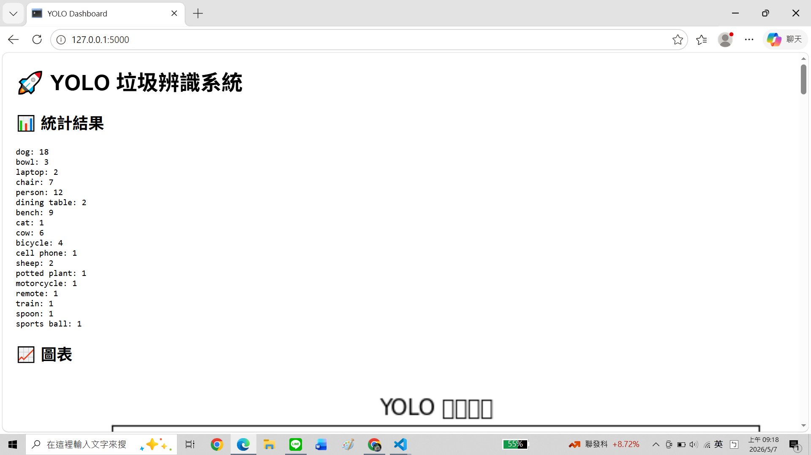
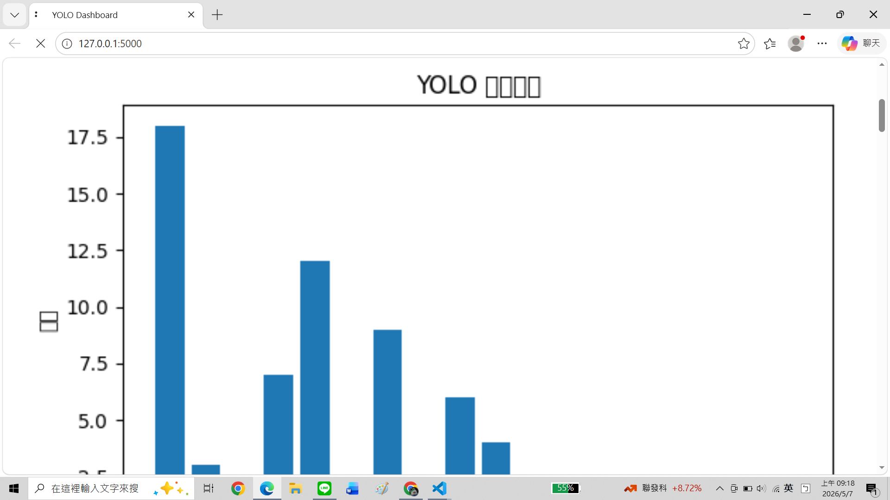
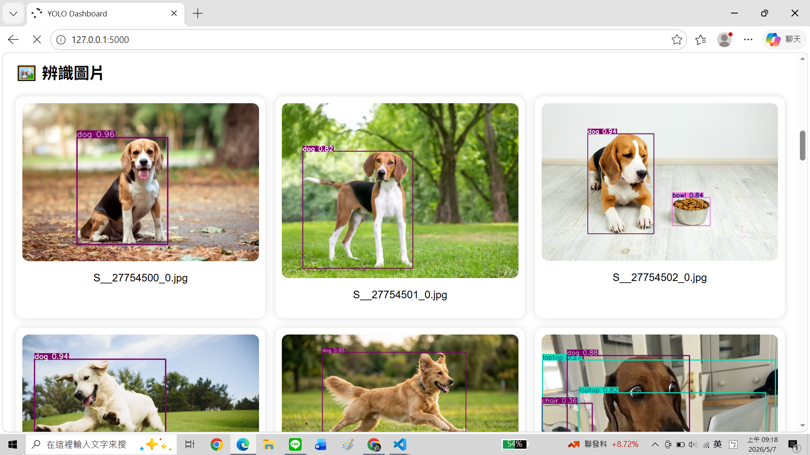
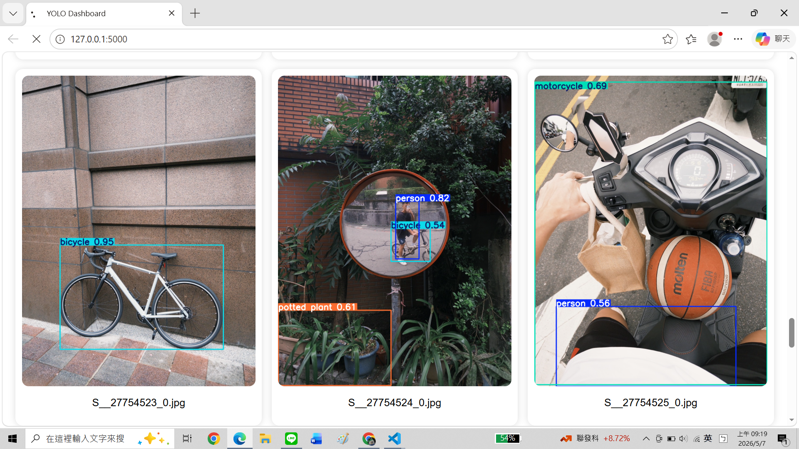

# 🚀 YOLO 即時影像辨識與 Web Dashboard 系統

## 📌 專案簡介

本專案結合 AI 影像辨識與 Web Dashboard 技術，使用 YOLOv8 進行物件辨識，並透過 Flask 建立即時監控網站。

系統能夠自動讀取圖片、辨識物件、統計結果、產生圖表，並將辨識後的圖片顯示於網頁上。

---

# 🧠 功能特色

✅ YOLOv8 影像辨識  
✅ 自動讀取圖片資料夾  
✅ 自動產生辨識框  
✅ 物件數量統計  
✅ Flask 即時網站展示  
✅ 圖表可視化（Matplotlib）  
✅ 自動更新 Dashboard  

---

# 📂 專案架構

```text
YOLO-Detection-Dashboard/
│
├── detect.py
├── app.py
├── result.txt
├── requirements.txt
├── README.md
│
├── data/
│   ├── captured_images/
│   └── detected_images/
│
└── static/
    └── chart.png
```

---

# ⚙️ 安裝方式

## 1️⃣ Clone 專案

```bash
git clone 你的GitHub網址
```

---

## 2️⃣ 安裝套件

```bash
pip install -r requirements.txt
```

---

# ▶️ 使用方式

## Step 1：放入圖片

將圖片放入：

```text
data/captured_images/
```

---

## Step 2：執行 YOLO 辨識

```bash
python detect.py
```

系統會自動：

- 辨識圖片
- 繪製辨識框
- 儲存辨識結果
- 產生統計資料

---

## Step 3：啟動 Flask 網站

```bash
python app.py
```

開啟瀏覽器：

```text
http://127.0.0.1:5000
```

---

# 📊 Dashboard 功能

網站提供：

- 物件統計結果
- 圖表可視化
- 辨識圖片展示
- 自動更新頁面

---

# 🖼️ 系統流程

```text
輸入圖片
    ↓
YOLO 影像辨識
    ↓
產生辨識結果
    ↓
儲存辨識圖片
    ↓
統計物件數量
    ↓
Flask Dashboard 顯示
```

---

# 🛠️ 使用技術

- Python
- YOLOv8
- Flask
- Matplotlib
- OpenCV

---

# 📸 成果展示

## YOLO 辨識結果

## Dashboard 網站畫面





# 📈 未來可擴充方向

- 即時攝影機辨識
- ESP32 Camera 整合
- 垃圾分類模型訓練
- 資料庫儲存
- 即時串流影像

---

# 👨‍💻 作者

Sam Lin